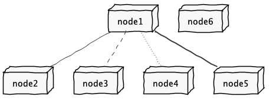

COGSI Project Repository
========================

# 1. General Notes about the Project of COGSI

COGSI has a project that runs during all the semester. The project is divided into 7 Parts (P1.1-P1.5, P2.1 and P2.2). Each part has an average duration of 2 weeks.

The goals for each part will be published in Moodle, in a specific document.

Each and every student should develop his/her work for each part in his/her own individual repository (that should be similar to this one).

Teacher will select a small set of students to submit and present their developments for each part.

The selected students should submit their work to the common repository (a repository similar to this one that will be published in moodle).

The selected students must present and discuss their work during a special session (usually scheduled to a lecture).

Students get feedback for their work during this session. They may improve their future work based on that feedback.

**Each student only does one presentation during the semester!**

# 2. Notes on the Organization of the Repositories

**Common repository**

There will be a common repository similar to this one.

The common repository is used to submit the contents of the developed part (only the selected students!). Students do not work on the common repository, it is only used for presentation submissions!

**individual repository**

Each student will have an individual repository. Students should use this repository for their development.

The repository is created and assigned by the teacher.

Students should use Bitbucket Issues to reference their work/commits in the repository. They should commit regularly.

**Students should not use the Bitbucket Wiki for documentation. All documentation should be done in the repository using markdown and the suggested MD files, following the structure that is exemplified here.**

**Both repositories must have the same structure of folders!**

# 3. Individual Pages/Folders

Each student should include all his/her work inside a top level folder. The name of the folder should be based on the student name and number. For instance, For student named Maria Ferreira (student number 1133224) the folder should be "1133224-maria-ferreira".

This folder should then be further divided into sub-folders, one for each part of the project. For instance:

	1133224-maria-ferreira/p1.1/
	1133224-maria-ferreira/p1.2/
	1133224-maria-ferreira/p1.3/
	1133224-maria-ferreira/p1.4/
	1133224-maria-ferreira/p1.5/
	1133224-maria-ferreira/p2.1/
	1133224-maria-ferreira/p2.2/

# 5. How to Use These README.md Type of Files

All documentation about the project should be included in readme.MD files in the repository.

Inside each sub-folder there should be a file named **readme.MD** with documentation about the part of the project. All the files/artifacts used for the part should be inside these folders (or in subfolders of theses folders).

**Images and PlantUml**

This repository includes a **build.gradle** file that can be used to generated images for PlantUML diagrams.

For processing all **.puml** files in the repository simply type in the root:

	gradle

For instance, the next image was generated with this command. The PlantUml file is **net.puml** (located in the root of the repository) and the resulting image is **net.png** (also located in the root of the repository).

**Note:** You will need to have **gradle** installed in your system to execute the command.
